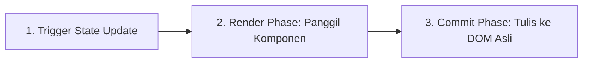

# 📙 Bab 03: State, Event, dan Form (Slide 13 – 20)

---

## 1. State dan Hook `useState` (Slide 13)

Variabel JavaScript biasa di dalam fungsi komponen akan di-reset setiap kali komponen dirender ulang. Untuk menyimpan memori yang bertahan antar-render dan memicu render ulang saat nilainya berubah, React menyediakan **State**.

```jsx
import { useState } from "react";

export default function Counter() {
  // [nilaiSaatIni, fungsiPembaru] = useState(nilaiAwal);
  const [count, setCount] = useState(0);

  return (
    <button onClick={() => setCount(count + 1)}>
      Diklik: {count} kali
    </button>
  );
}
```

### Hal Penting tentang State:
- `setCount` tidak sekadar mengubah angka di memori; ia **menjadwalkan render ulang** komponen.
- Setiap instance komponen memiliki memori state yang independen (dua buah `<Counter />` di halaman yang sama tidak akan saling mengganggu).
- Nilai awal (`0` pada contoh di atas) hanya dipakai pada render pertama (*initial render*).

---

## 2. Siklus Render dan Commit (Slide 14)

Memahami cara kerja React memperbarui antarmuka terdiri dari 3 fase:



1. **Trigger:** Terjadi interaksi pengguna (misal klik tombol) yang memanggil fungsi pembaru state (`setCount`).
2. **Render Phase:** React memanggil fungsi komponen untuk menghitung elemen JSX baru dan membandingkannya (*diffing*) dengan render sebelumnya.
   > ⚠️ **Aturan Emas:** Fase render **harus murni (pure)**! Tidak boleh melakukan request API, memanipulasi DOM langsung, atau mengubah variabel di luar komponen selama tahap render.
3. **Commit Phase:** React hanya mengubah node DOM yang benar-benar mengalami perbedaan.

---

## 3. State Adalah Snapshot (Slide 15)

Salah satu konsep yang paling sering membingungkan pemula: **State bernilai tetap (*snapshot*) selama satu siklus render berjalan.**

Ketika Anda memanggil setter state, variabel state pada baris berikutnya **belum berubah**!

### Eksperimen: Apa yang Terjadi?
```jsx
function Counter() {
  const [count, setCount] = useState(0);

  function handleClick() {
    // Misalnya saat ini count = 0
    setCount(count + 1); // Meminta render berikutnya dengan nilai: 0 + 1 = 1
    setCount(count + 1); // Masih membaca count = 0, meminta render berikutnya dengan: 0 + 1 = 1
    setCount(count + 1); // Masih membaca count = 0, meminta render berikutnya dengan: 0 + 1 = 1
  }
  // Hasil pada render berikutnya: count hanya menjadi 1, BUKAN 3!
}
```

### Solusi: Gunakan Updater Function!
Jika nilai state baru bergantung pada nilai state sebelumnya, kirimkan fungsi (*updater function*):
```jsx
function handleClick() {
  // Updater function menerima nilai paling mutakhir dari antrean state
  setCount(c => c + 1); // c = 0 -> 1
  setCount(c => c + 1); // c = 1 -> 2
  setCount(c => c + 1); // c = 2 -> 3
  // Hasil pada render berikutnya: count menjadi 3!
}
```

---

## 4. Bekerja dengan Object dan Array dalam State (Slide 16)

State di React harus diperlakukan sebagai **data yang tidak boleh diubah langsung (*immutable*)**.

### ❌ Kesalahan Fatal: Mengubah State Secara Langsung (Mutasi)
```javascript
// JANGAN PERNAH LAKUKAN INI:
tasks.push(newTask); // Memutasi array asli!
user.name = "Ayu";   // Memutasi object asli!
setTasks(tasks);     // React memeriksa referensi memori, karena sama, TIDAK AKAN RE-RENDER!
```

### ✅ Cara Benar: Selalu Buat Salinan Baru (Copy / Immutability)

#### Mengubah Properti Object:
```javascript
setUser(prevUser => ({
  ...prevUser, // Salin properti lama
  name: "Ayu"  // Timpa nilai properti yang berubah
}));
```

#### Menambahkan Elemen ke Array:
```javascript
setTasks(prevTasks => [
  ...prevTasks, // Salin elemen lama
  newTask       // Tambahkan elemen baru di akhir
]);
```

#### Mengubah Item Tertentu di Array (Gunakan `.map()`):
```javascript
setTasks(prevTasks => 
  prevTasks.map(task => 
    task.id === targetId 
      ? { ...task, done: !task.done } // Buat object tugas baru
      : task                          // Biarkan item yang tidak berubah
  )
);
```

#### Menghapus Item dari Array (Gunakan `.filter()`):
```javascript
setTasks(prevTasks => 
  prevTasks.filter(task => task.id !== targetId)
);
```

---

## 5. State Minimal dan Nilai Turunan (*Derived State*) (Slide 17)

Prinsip desain React yang baik: **Hanya simpan data mentah yang benar-benar tidak bisa dihitung dari data lain.**

### ❌ Anti-pattern: Menyimpan Hasil Hitungan ke State Tambahan
```jsx
// BURUK: Menyimpan 'total' dan 'remaining' ke state tersendiri
const [tasks, setTasks] = useState([]);
const [remainingCount, setRemainingCount] = useState(0); // Rentan desinkronisasi!
```

### ✅ Solusi Bersih: Hitung Langsung Saat Render!
```jsx
const [tasks, setTasks] = useState([]);
const [query, setQuery] = useState("");

// Hitung nilai turunan secara langsung saat render:
const visibleTasks = tasks.filter(t => 
  t.title.toLowerCase().includes(query.toLowerCase())
);
const remainingCount = tasks.filter(t => !t.done).length;
```
*Hasil perhitungan ini selalu akurat, tidak membutuhkan `useEffect`, dan bebas dari bug desinkronisasi.*

---

## 6. Form Terkontrol (*Controlled Components*) (Slide 18)

Dalam form terkontrol, nilai elemen form (`<input>`, `<textarea>`, `<select>`) didorong oleh state React dan diperbarui melalui event `onChange`.

```jsx
export default function FormName() {
  const [name, setName] = useState("");

  return (
    <div>
      {/* htmlFor terhubung dengan id input untuk kenyamanan dan aksesibilitas */}
      <label htmlFor="name-input">Nama Pengguna:</label>
      <input
        id="name-input"
        type="text"
        value={name}
        onChange={e => setName(e.target.value)}
        placeholder="Masukkan nama..."
      />
      <p>Halo, {name || "Tamu"}!</p>
    </div>
  );
}
```

---

## 7. Berbagi State (*Lifting State Up*) (Slide 19)

Ketika dua atau lebih komponen anak membutuhkan data yang sama atau ingin saling sinkron, pindahkan (*lift*) state ke komponen induk (*parent*) terdekat yang menaungi keduanya.

```jsx
// Komponen Induk menyimpan single source of truth
function ParentApp() {
  const [value, setValue] = useState("");

  return (
    <div className="layout">
      {/* Editor bisa mengubah nilai */}
      <Editor value={value} onChange={setValue} />
      
      {/* Preview membaca nilai yang sama */}
      <Preview value={value} />
    </div>
  );
}
```

---

## 8. Identitas Komponen dan Reset State dengan `key` (Slide 20)

React mengaitkan memori state dengan posisi komponen pada pohon UI. Terkadang, Anda ingin **mereset total** state sebuah form ketika pengguna berpindah konteks (misalnya berganti penerima pesan obrolan).

Dengan mengganti prop `key`, React akan menganggapnya sebagai komponen baru, menghancurkan komponen lama beserta seluruh state-nya, dan membuat instance baru yang bersih:

```jsx
function ChatBox({ recipient }) {
  // Tanpa key, saat 'recipient' berubah, draft pesan lama mungkin tidak sengaja terkirim ke orang baru!
  // Dengan key={recipient.id}, form akan otomatis di-reset saat penerima berganti!
  return <Chat key={recipient.id} recipient={recipient} />;
}
```
