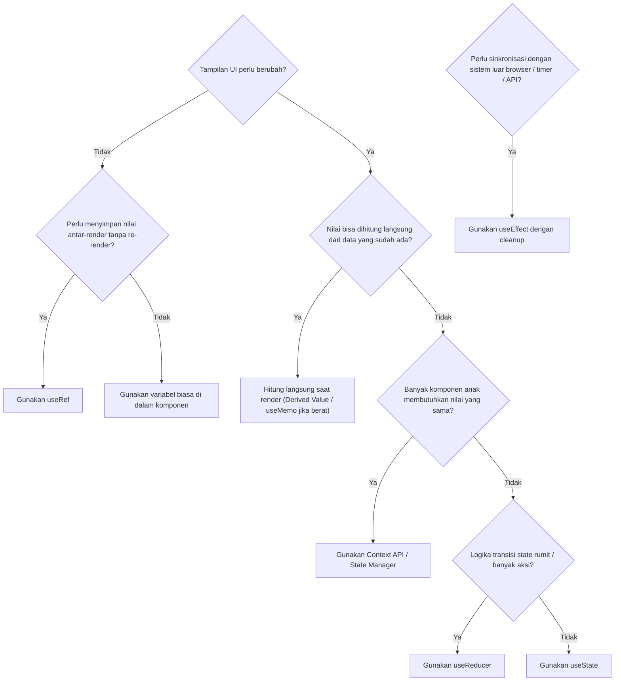

# 🧭 Bab 08: Peta Keputusan & Glosarium React (Slide 47 – 48)

---

## 1. Peta Keputusan Sehari-hari (*Decision Tree*) (Slide 47)

Saat sedang mengoding aplikasi dengan React, sering kali kita bingung: *"Apakah saya harus pakai useState? useRef? useEffect? atau apa?"*

Gunakan diagram alur dan panduan keputusan berikut:

### Tabel Rangkuman Cepat (*Cheat Sheet*):

| Pertanyaan / Kebutuhan | Solusi Rekomendasi | Contoh Kasus |
|---|---|---|
| **Apakah tampilan perlu berubah saat data berubah?** | `useState` | Menghitung klik, membuka modal dialog, status checkbox |
| **Apakah nilai dapat dihitung dari data yang sudah ada?** | **Hitung saat render** *(Derived State)* | Total harga keranjang, jumlah tugas aktif, hasil filter pencarian |
| **Apakah nilai perlu bertahan tapi TIDAK boleh memicu re-render?** | `useRef` | Menyimpan ID interval/timer, referensi elemen DOM input |
| **Perlu menyinkronkan data dengan sistem luar React?** | `useEffect` | Berlangganan WebSocket, resize window, integrasi map SDK |
| **Logika transisi state rumit dengan banyak aksi berbeda?** | `useReducer` | Form registrasi multi-step, keranjang belanja dengan voucher |
| **Banyak turunan komponen butuh data yang sama tanpa prop drilling?** | `createContext` + `useContext` | Tema Gelap/Terang, data autentikasi user login, bahasa UI |
| **Ingin menghindari pembekuan UI saat proses pemfilteran data besar?** | `useTransition` / `useDeferredValue` | Kotak pencarian autocomplete dengan ribuan data |

---

## 2. Glosarium Istilah React (A – Z)

| Istilah | Pengertian / Penjelasan Sederhana |
|---|---|
| **Children** | Prop khusus yang mewakili elemen apa pun yang diletakkan di antara tag pembuka dan penutup sebuah komponen. |
| **Cleanup Function** | Fungsi pengembalian di dalam `useEffect` yang bertugas membereskan efek samping (misal: mematikan timer atau melepas event listener). |
| **Closure** | Kemampuan sebuah fungsi di JavaScript untuk mengingat variabel-variabel di lingkup sekitarnya saat fungsi itu diciptakan. |
| **Component** | Blok pembangun independen dan reusable dalam aplikasi React yang mengembalikan deskripsi UI. |
| **Context** | Mekanisme berbagi data ke seluruh pohon komponen tanpa harus mengoper props secara manual di setiap tingkat hierarki. |
| **CSR (Client Side Rendering)** | Metode rendering di mana browser mengunduh HTML kosong dan JavaScript yang kemudian merakit tampilan di perangkat pengguna. |
| **Declarative** | Gaya pemrograman di mana kita mendeskripsikan *apa* hasil akhir tampilan yang diinginkan, bukan langkah demi langkah *bagaimana* membuatnya. |
| **Derived State** | Nilai yang dihitung secara dinamis dari state atau props yang sudah ada saat render, tanpa perlu membuat state baru. |
| **Hydration** | Proses di mana React membaca HTML yang sudah dibuat di server (SSR) dan menempelkan logika event listener ke elemen-elemen tersebut di browser. |
| **Immutability** | Prinsip di mana data tidak boleh diubah secara langsung; pembaruan dilakukan dengan membuat objek atau array salinan baru. |
| **JSX** | Ekstensi sintaksis mirip HTML untuk JavaScript yang memudahkan pembuatan elemen React. |
| **Key** | Properti unik dan stabil yang wajib diberikan saat merender list elemen untuk membantu React melacak identitas elemen tersebut. |
| **Lifting State Up** | Memindahkan state ke komponen induk terdekat agar dua atau lebih komponen anak dapat berbagi data yang sama. |
| **Memoization** | Teknik optimasi yang menyimpan hasil komputasi berat agar tidak perlu dihitung ulang jika inputnya belum berubah. |
| **Props** | Data input yang dikirimkan oleh komponen parent ke komponen child bersifat *read-only*. |
| **Race Condition** | Bug di mana urutan selesainya beberapa request asinkron tidak menentu sehingga data lama berpotensi menimpa data yang lebih baru. |
| **React Server Components (RSC)** | Komponen React modern yang dieksekusi secara eksklusif di sisi server dan tidak menyertakan kode JavaScript komponen tersebut ke browser. |
| **Re-render** | Proses di mana React memanggil kembali fungsi komponen untuk memperbarui tampilan UI setelah terjadi perubahan state atau props. |
| **SSR (Server Side Rendering)** | Pembuatan kode HTML siap tampil langsung di server sebelum dikirimkan ke browser pengguna. |
| **State** | Memori internal sebuah komponen yang nilainya dapat berubah dan perubahan tersebut memicu render ulang UI. |
| **StrictMode** | Komponen pembantu React untuk fase pengembangan yang mengeksekusi efek 2 kali guna mendeteksi efek samping yang bermasalah. |
| **Virtual DOM** | Representasi ringan dari DOM browser asli di dalam memori yang digunakan React untuk menghitung perbedaan sebelum menulis ke layar. |

---

## 3. Langkah Berikutnya & Referensi (Slide 48)

- **Dokumentasi Resmi React:** [react.dev/learn](https://react.dev/learn)
- **Referensi Lengkap API React:** [react.dev/reference/react](https://react.dev/reference/react)
- **Tutorial Interaktif Tic-Tac-Toe:** [react.dev/learn/tutorial-tic-tac-toe](https://react.dev/learn/tutorial-tic-tac-toe)
- Jalankan web playground lokal Anda dengan `npm run dev` untuk mencoba langsung setiap materi di atas!
