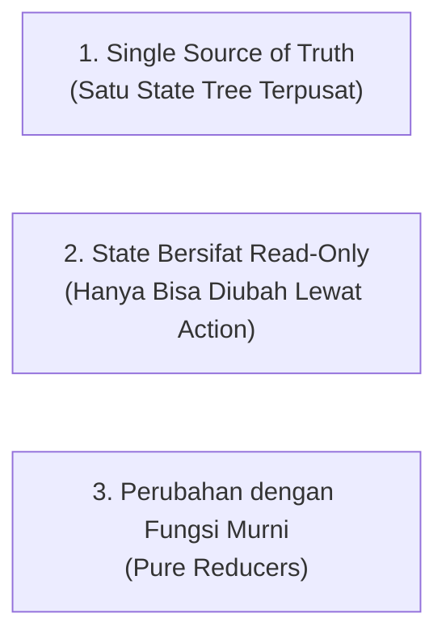
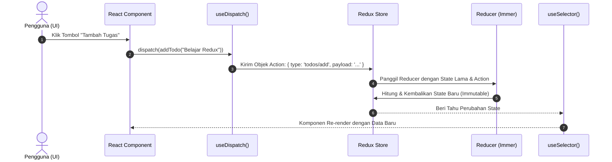

# 🗄️ Bab 09: Panduan Lengkap Redux & Redux Toolkit (RTK)

Selamat datang di materi komprehensif **Redux & Redux Toolkit (RTK)** untuk React.
Dokumen ini menjelaskan mengapa Redux diciptakan, 3 prinsip dasarnya, arsitektur aliran data satu arah (*unidirectional data flow*), cara modern menggunakan **Redux Toolkit**, penanganan *asynchronous logic* dengan `createAsyncThunk`, serta perbandingannya dengan Context API dan Zustand.

---

## 1. Mengapa Butuh Redux? (*The Motivation*)

Saat aplikasi React masih kecil, mengelola state menggunakan `useState` atau membagikannya dengan `useContext` sudah cukup memadai. Namun, seiring bertambah besarnya aplikasi dengan puluhan halaman dan ratusan komponen:

### Masalah yang Muncul:
1. **Prop Drilling yang Parah:** Mengoper props melewati 5 hingga 10 lapis komponen hanya agar komponen cucu terdalam bisa membaca atau mengubah data.
2. **Re-render Berlebihan pada Context:** Mengubah satu nilai di dalam `Context` akan memicu render ulang pada *semua* komponen yang mengonsumsi Context tersebut, meskipun mereka hanya butuh sebagian kecil properti.
3. **Sulit Dilacak (*Debugging Nightmare*):** Jika state berubah di 10 tempat berbeda secara acak, sangat sulit mengetahui *siapa*, *kapan*, dan *mengapa* state tersebut berubah.

### Solusi Redux:
Redux menyediakan **satu wadah terpusat (*Single Store*)** di luar hierarki komponen. Setiap perubahan data wajib melalui **Action** yang terdata, dieksekusi oleh fungsi murni (**Reducer**), sehingga alur aplikasi menjadi 100% dapat diprediksi (*predictable*) dan mendukung fitur ajaib seperti **Time-Travel Debugging**.

---

## 2. Tiga Prinsip Utama Redux (*Three Principles*)



1. **Single Source of Truth:**
   Seluruh state aplikasi global disimpan dalam satu objek pohon (*state tree*) di dalam satu **Store**.
2. **State Is Read-Only:**
   Satu-satunya cara mengubah state adalah dengan mengirimkan (**dispatch**) sebuah **Action** (objek yang mendeskripsikan *apa yang terjadi*).
3. **Changes Are Made with Pure Reducer Functions:**
   Untuk menentukan bagaimana state diubah oleh action, kita menulis **Reducer** (fungsi murni yang menerima `(state, action)` dan mengembalikan `stateBaru` tanpa efek samping).

---

## 3. Alur Data Redux (*Unidirectional Data Flow*)



---

## 4. Redux Modern: Redux Toolkit (RTK) vs Legacy Redux

Dahulu (Redux klasik), developer sering mengeluhkan Redux karena memerlukan terlalu banyak kode berulang (*boilerplate*): file `types.js`, `actions.js`, `reducer.js` dengan puluhan `switch-case`, serta setup middleware yang rumit.

**Redux Toolkit (RTK)** adalah standar resmi modern yang memangkas kode tersebut hingga 80%:

| Fitur | Redux Klasik (Lama) | Redux Toolkit (Modern) |
|---|---|---|
| **Setup Store** | `createStore()`, konfigurasi middleware manual, setup devtools rumit | `configureStore()` (otomatis mengaktifkan Thunk & DevTools) |
| **Definisi Logika** | Pisah file actions, action types, switch-case reducers | `createSlice()` (menggabungkan actions & reducers jadi satu) |
| **Immutability** | Wajib spread manual `...state` di setiap level bertingkat | Otomatis menggunakan pustaka **Immer**, boleh menulis gaya mutasi `state.push()` |
| **Async Request** | Setup redux-thunk atau redux-saga secara manual | `createAsyncThunk()` bawaan langsung dari RTK |

---

## 5. Panduan Instalasi & Setup Lengkap

### Langkah 1: Instalasi Paket
Jalankan perintah berikut di proyek React Anda:
```bash
npm install @reduxjs/toolkit react-redux
```

---

### Langkah 2: Membuat Slice (`src/features/counter/counterSlice.js`)
*Slice* membungkus nama fitur, state awal (*initial state*), dan fungsi-fungsi reducer:

```javascript
import { createSlice } from '@reduxjs/toolkit';

const initialState = {
  value: 0,
  history: []
};

export const counterSlice = createSlice({
  name: 'counter',
  initialState,
  reducers: {
    // Berkat Immer di RTK, kita boleh menulis gaya mutasi langsung:
    increment: (state) => {
      state.value += 1;
      state.history.push(`+1 pada ${new Date().toLocaleTimeString()}`);
    },
    decrement: (state) => {
      state.value -= 1;
      state.history.push(`-1 pada ${new Date().toLocaleTimeString()}`);
    },
    incrementByAmount: (state, action) => {
      state.value += action.payload;
      state.history.push(`+${action.payload} pada ${new Date().toLocaleTimeString()}`);
    },
    reset: (state) => {
      state.value = 0;
      state.history = [];
    }
  }
});

// Ekspor action creators otomatis:
export const { increment, decrement, incrementByAmount, reset } = counterSlice.actions;

// Ekspor reducer untuk store:
export default counterSlice.reducer;
```

---

### Langkah 3: Membuat Store Terpusat (`src/app/store.js`)
```javascript
import { configureStore } from '@reduxjs/toolkit';
import counterReducer from '../features/counter/counterSlice';

export const store = configureStore({
  reducer: {
    counter: counterReducer
  }
});
```

---

### Langkah 4: Memasang Provider ke Root React (`src/main.jsx`)
```jsx
import React from 'react';
import ReactDOM from 'react-dom/client';
import { Provider } from 'react-redux';
import { store } from './app/store';
import App from './App';

ReactDOM.createRoot(document.getElementById('root')).render(
  <React.StrictMode>
    {/* Seluruh komponen di dalam Provider memiliki akses ke Redux Store */}
    <Provider store={store}>
      <App />
    </Provider>
  </React.StrictMode>
);
```

---

### Langkah 5: Membaca & Mengubah State di Komponen (`useSelector` & `useDispatch`)
```jsx
import React from 'react';
import { useSelector, useDispatch } from 'react-redux';
import { increment, decrement, incrementByAmount, reset } from '../features/counter/counterSlice';

export function CounterWidget() {
  // 1. Membaca data state dari store:
  const count = useSelector((state) => state.counter.value);
  const history = useSelector((state) => state.counter.history);

  // 2. Mendapatkan fungsi dispatch:
  const dispatch = useDispatch();

  return (
    <div className="card">
      <h2>Jumlah: {count}</h2>
      
      <div className="button-group">
        {/* 3. Mengirimkan action ke store: */}
        <button onClick={() => dispatch(increment())}>+1</button>
        <button onClick={() => dispatch(decrement())}>-1</button>
        <button onClick={() => dispatch(incrementByAmount(5))}>+5</button>
        <button onClick={() => dispatch(reset())}>Reset</button>
      </div>

      <ul>
        {history.map((log, idx) => (
          <li key={idx}>{log}</li>
        ))}
      </ul>
    </div>
  );
}
```

---

## 6. Mengelola Operasi Asinkron dengan `createAsyncThunk`

Untuk mengambil data dari API, RTK menyediakan `createAsyncThunk` yang secara otomatis menghasilkan 3 status aksi: `pending`, `fulfilled`, dan `rejected`:

```javascript
import { createSlice, createAsyncThunk } from '@reduxjs/toolkit';

// 1. Definisikan Thunk:
export const fetchUsers = createAsyncThunk(
  'users/fetchUsers',
  async (page = 1, { rejectWithValue }) => {
    try {
      const response = await fetch(`https://jsonplaceholder.typicode.com/users?_page=${page}`);
      return await response.json();
    } catch (err) {
      return rejectWithValue(err.message);
    }
  }
);

// 2. Tangani di extraReducers:
const usersSlice = createSlice({
  name: 'users',
  initialState: {
    data: [],
    loading: false,
    error: null
  },
  reducers: {},
  extraReducers: (builder) => {
    builder
      .addCase(fetchUsers.pending, (state) => {
        state.loading = true;
        state.error = null;
      })
      .addCase(fetchUsers.fulfilled, (state, action) => {
        state.loading = false;
        state.data = action.payload;
      })
      .addCase(fetchUsers.rejected, (state, action) => {
        state.loading = false;
        state.error = action.payload;
      });
  }
});

export default usersSlice.reducer;
```

---

## 7. Kapan Menggunakan Redux vs Context API vs Zustand?

| Kriteria Pemilihan | `useState` Lokal | Context API | Redux Toolkit (RTK) | Zustand |
|---|---|---|---|---|
| **Cakupan State** | 1 Komponen & anaknya | Tema, Auth, Bahasa | Skala besar enterprise | Skala menengah - besar |
| **Frekuensi Update** | Sangat cepat | Jarang berubah | Sedang - sering | Sedang - sering |
| **Overhead Kode** | Minimal (0) | Rendah | Menengah (RTK) | Sangat Ringkas |
| **Time-Travel Debug** | ❌ Tidak | ❌ Tidak | ✅ Sangat Kuat | ✅ Mendukung |
| **Ekosistem Middleware**| ❌ Tidak | ❌ Tidak | ✅ Sangat Kaya | ✅ Ada |
| **Rekomendasi Kasus** | Form input, accordion, modal terbuka | User login, dark/light theme | Keranjang e-commerce, dashboard multi-tab, sinkronisasi data global | State global modern tanpa boilerplate Provider |

---

## 8. Ringkasan & Kesimpulan

1. Gunakan **`useState`** untuk state lokal komponen.
2. Gunakan **`Context API`** untuk data statis yang jarang berubah (tema, preferensi bahasa).
3. Gunakan **`Redux Toolkit (RTK)`** ketika aplikasi Anda memiliki data transaksi kompleks yang dibagikan ke banyak layar dan membutuhkan alur audit (*action logging*) yang ketat.
